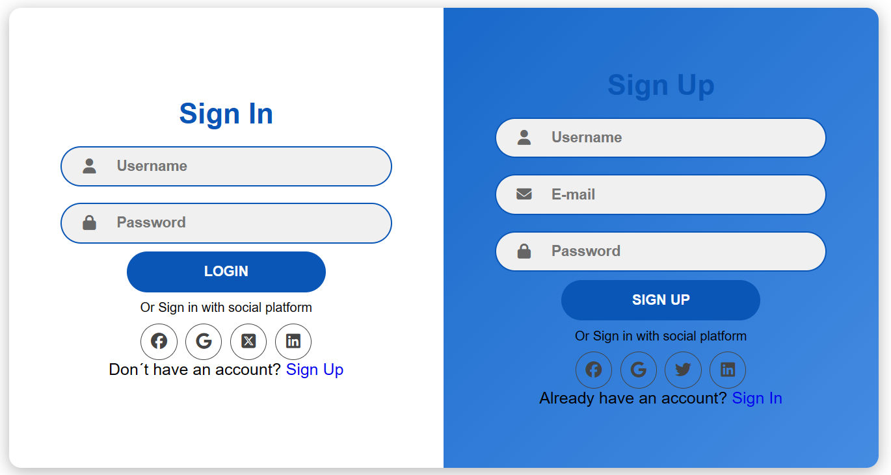
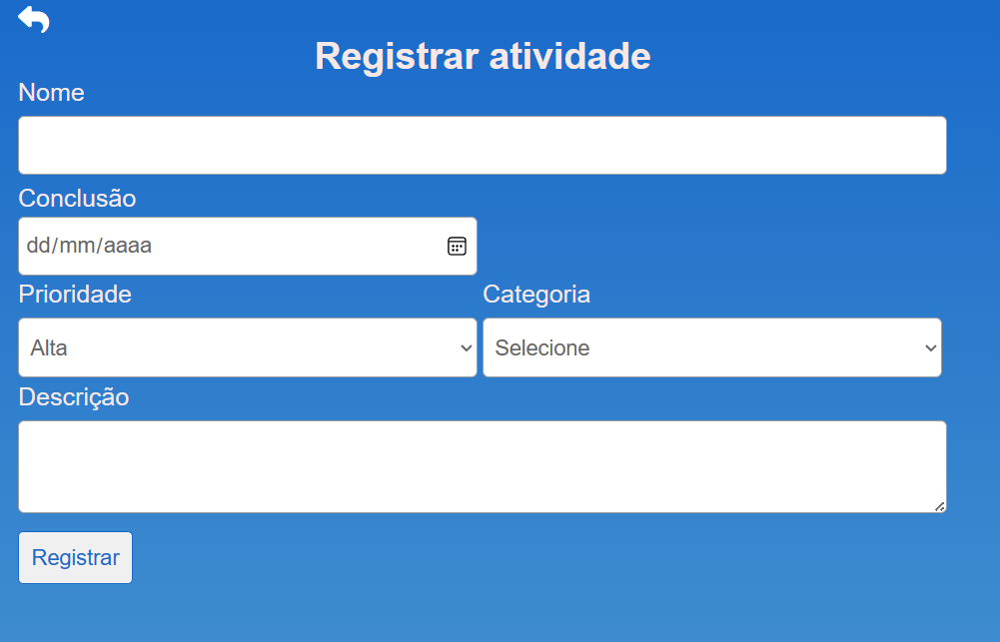

# Gerenciador de Tarefas

# Descrição

Este projeto é uma aplicação de controle de tarefas, concebido para armazenar informações de usuários e suas respectivas tarefas. A plataforma oferece aos usuários a capacidade de gerenciar suas tarefas de forma eficiente, permitindo-lhes visualizar facilmente tarefas atrasadas, em andamento ou concluídas. Desenvolvido com o propósito de aprofundar o conhecimento em PHP, este projeto representa a aplicação prática de conceitos teóricos previamente estudados.

_______________________________________

____________________________________________

# Funcionalidades

° Cadastro de usuários  

° Usuários podem fazer login  

° Cadastrar tarefas  

° Listar tarefas  

° Listar tarefas de acordo com a categoria solicitada  

° Deletar tarefas  

° Atualização de tarefas  

° Atualização do status da tarefa com base na data de conclusão e data atual  

# Tecnologias 

° PHP  

° MySQL  

° HTML  

° CSS  

° JavaScript  

# Inicialização

Este projeto foi desenvolvido no ambiente Windows, utilizando as tecnologias mencionadas anteriormente. No entanto, se você estiver utilizando outro sistema operacional, é importante ressaltar que a configuração inicial do projeto pode variar um pouco. Recomendamos que você busque informações específicas sobre como preparar o ambiente para as tecnologias mencionadas, de acordo com o sistema operacional que estiver utilizando. Essa busca por informações adicionais garantirá que você tenha uma configuração adequada para o desenvolvimento do projeto em seu ambiente específico.

# Implementações Futuras

1. Implementar autenticação do usuário mais segura (JWT).
2. Implementar testes.
3. Aplicar melhorias no banco de dados e nas queries.

# Status do Projeto

Em desenvolvimento
