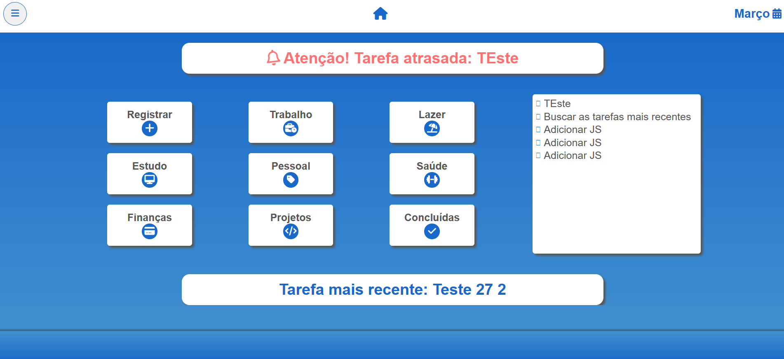

<i class="fa-solid fa-link"></i> Gerenciador de Tarefas

<i class="fa-solid fa-book-open"></i> Descrição

Este projeto é uma aplicação de controle de tarefas, concebido para armazenar informações de usuários e suas respectivas tarefas. A plataforma oferece aos usuários a capacidade de gerenciar suas tarefas de forma eficiente, permitindo-lhes visualizar facilmente tarefas atrasadas, em andamento ou concluídas. Desenvolvido com o propósito de aprofundar o conhecimento em PHP, este projeto representa a aplicação prática de conceitos teóricos previamente estudados.

_______________________________________

____________________________________________

<i class="fa-solid fa-screwdriver-wrench"></i> Funcionalidades

<i class="fa-solid fa-circle fa-bounce fa-2xs"></i> Cadastro de usuários
<i class="fa-solid fa-circle fa-bounce fa-2xs"></i> Usuários podem fazer login
<i class="fa-solid fa-circle fa-bounce fa-2xs"></i> Cadastrar tarefas
<i class="fa-solid fa-circle fa-bounce fa-2xs"></i> Listar tarefas
<i class="fa-solid fa-circle fa-bounce fa-2xs"></i> Listar tarefas de acordo com a categoria solicitada
<i class="fa-solid fa-circle fa-bounce fa-2xs"></i> Deletar tarefas
<i class="fa-solid fa-circle fa-bounce fa-2xs"></i> Atualização de tarefas
<i class="fa-solid fa-circle fa-bounce fa-2xs"></i> Atualização do status da tarefa com base na data de conclusão e data atual

<i class="fa-solid fa-code"></i> Tecnologias 

<i class="fa-solid fa-circle fa-bounce fa-2xs"></i> PHP
<i class="fa-solid fa-circle fa-bounce fa-2xs"></i> MySQL
<i class="fa-solid fa-circle fa-bounce fa-2xs"></i> HTML
<i class="fa-solid fa-circle fa-bounce fa-2xs"></i> CSS
<i class="fa-solid fa-circle fa-bounce fa-2xs"></i> JavaScript

<i class="fa-solid fa-hourglass-start"></i> Inicialização

Este projeto foi desenvolvido no ambiente Windows, utilizando as tecnologias mencionadas anteriormente. No entanto, se você estiver utilizando outro sistema operacional, é importante ressaltar que a configuração inicial do projeto pode variar um pouco. Recomendamos que você busque informações específicas sobre como preparar o ambiente para as tecnologias mencionadas, de acordo com o sistema operacional que estiver utilizando. Essa busca por informações adicionais garantirá que você tenha uma configuração adequada para o desenvolvimento do projeto em seu ambiente específico.

<i class="fa-solid fa-link"></i> Implementações Futuras

1. Implementar autenticação do usuário mais segura (JWT).
2. Implementar testes.
3. Aplicar melhorias no banco de dados e nas queries.

Status do Projeto

